# VDS Seeder Guideline

## Mục lục
1. [Requirements](#requirements)
2. [Hướng dẫn sử dụng](#hướng-dẫn-sử-dụng)
   - [Bước 1: Cấu hình API](#bước-1-cấu-hình-api)
   - [Bước 2: Đăng nhập](#bước-2-đăng-nhập)
   - [Bước 3: Chọn Resource cần Seed](#bước-3-chọn-resource-cần-seed)
   - [Bước 4: Cấu hình chế độ Seed](#bước-4-cấu-hình-chế-độ-seed)
   - [Bước 5: Generate & Preview Data](#bước-5-generate--preview-data)
   - [Bước 6: Seed Data](#bước-6-seed-data)
3. [Các tính năng chính](#các-tính-năng-chính)
4. [Known Issues](#known-issues)
5. [Technical Notes](#technical-notes)

---

## Requirements

- **Auth Server Information**
  - **Root URL**: Dùng để tạo link đăng nhập phía FE
  - **Client ID**: ID của FE app đã đăng ký với auth server
  - **Redirect URL**: Auth server sẽ dùng link đã đăng ký này của FE để gửi exchange code
  - **Scope**: Resource cần cấp phép truy cập (chọn `MonoTemplate`)

- **Backend Server Information**
  - **Root URL**: API của backend cho FE gọi

> **Lưu ý**: Dựa vào thông tin auth server đã cung cấp, phải đăng nhập mới có thể sử dụng.

---

## Hướng dẫn sử dụng

### Bước 1: Cấu hình API

Trước khi bắt đầu, cần cấu hình thông tin Auth Server và Backend API.

#### Cách mở Settings:
- Click vào icon **Settings** (hình bánh răng) ở góc phải header

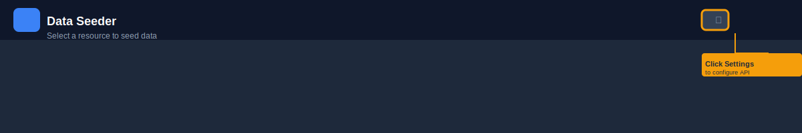

#### Giao diện Settings:
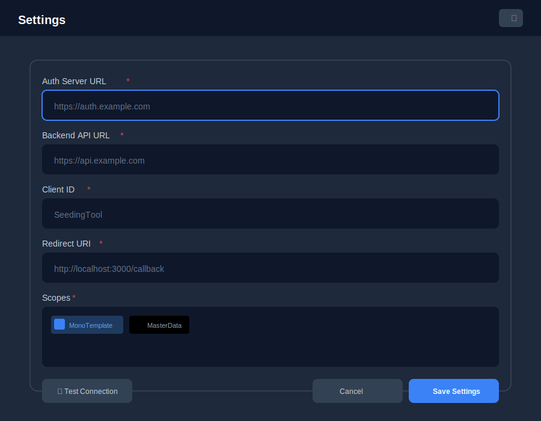

#### Các trường cần điền:

| Trường | Mô tả | Ví dụ |
|--------|-------|-------|
| Auth Server URL | URL của auth server | `http://localhost:7001/` |
| Backend API URL | URL của backend API | `http://localhost:7001/` |
| Client ID | ID đã đăng ký với auth | `SeedingTool` |
| Redirect URI | URL callback (tự động điền) | `http://localhost:3000/callback` |
| Scopes | Quyền truy cập | `MonoTemplate` |

#### Kiểm tra kết nối:
- Click **Test Connection** để xác nhận kết nối thành công

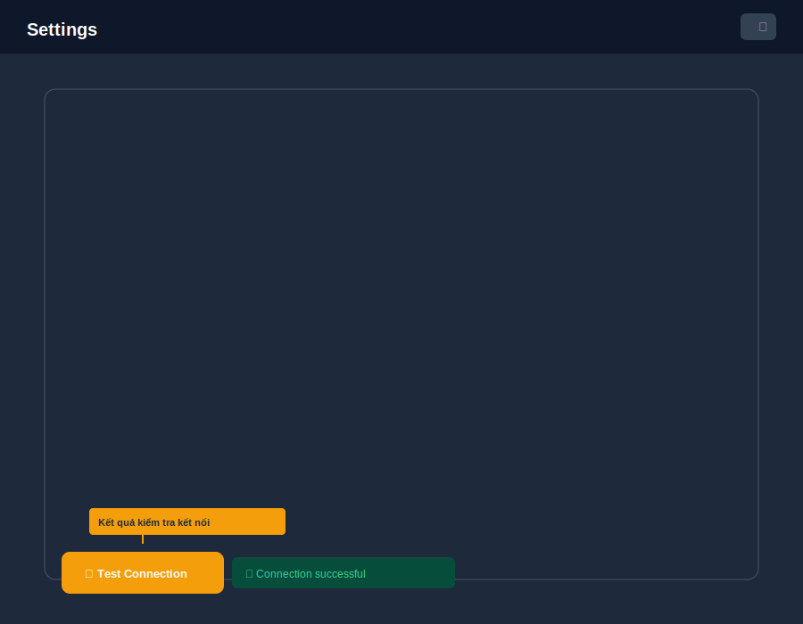

#### Lưu cấu hình:
- Click **Save Settings** để lưu lại

---

### Bước 2: Đăng nhập

Sau khi cấu hình xong, hệ thống yêu cầu đăng nhập qua Auth Server.

#### Giao diện chưa đăng nhập:
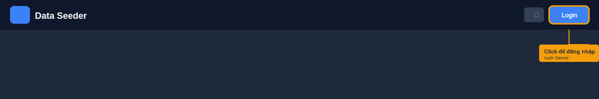

#### Click nút Login:
- Hệ thống sẽ redirect sang trang đăng nhập của Auth Server
- Sau khi đăng nhập thành công, sẽ quay lại ứng dụng

#### Trạng thái đã đăng nhập:
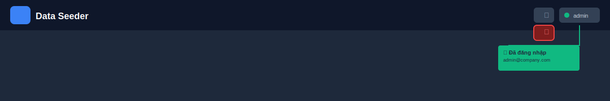

- Hiển thị thông tin user (username/email)
- Nút Logout để đăng xuất

---

### Bước 3: Chọn Resource cần Seed

#### Trang chủ - Danh sách Resources:
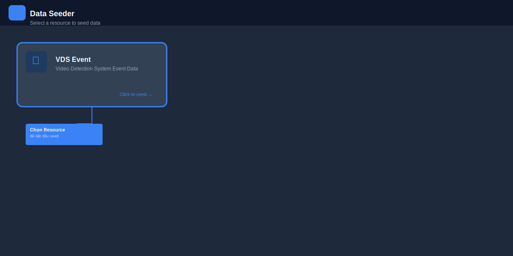

#### Các Resource hiện có:
| Resource | Mô tả |
|----------|-------|
| VDS Event | Video Detection System Event Data |

#### Cách chọn:
- Click vào card của resource cần seed
- Hệ thống sẽ chuyển sang trang seed tương ứng

---

### Bước 4: Cấu hình chế độ Seed

#### 4.1 Chọn Seed Mode (Request Mode)

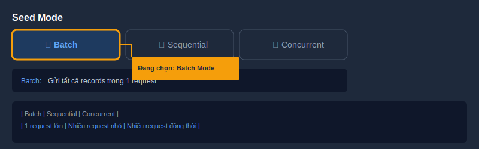

| Mode | Mô tả |
|------|-------|
| **Batch** | Gửi tất cả records trong 1 request |
| **Sequential** | Gửi từng record một (/sequence endpoint) |
| **Concurrent** | Gửi nhiều requests đồng thời (/sequence endpoint) |

#### 4.2 Cấu hình số lượng Record

**Batch Mode:**
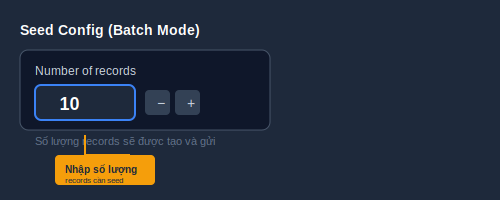

**Concurrent Mode:**
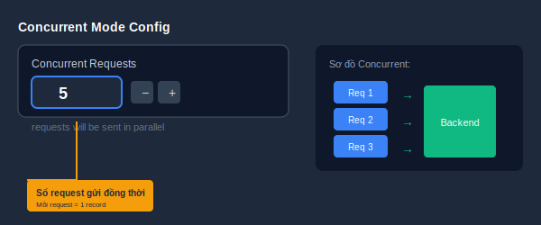

#### 4.3 Cấu hình Field Generation Mode

Mỗi field có 3 chế độ:

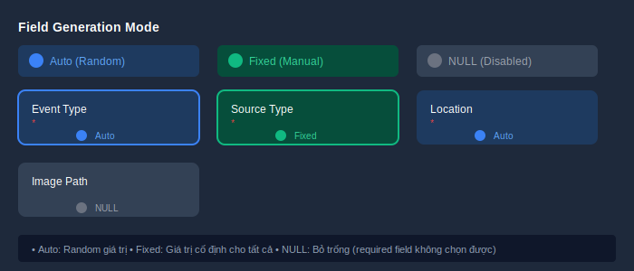

| Mode | Màu | Mô tả |
|------|-----|--------|
| **Auto** | Xanh dương | Fake random cho mỗi record |
| **Fixed** | Xanh lá | Giá trị cố định (nhập manual) |
| **NULL** | Xám | Để NULL cho tất cả records |

#### Ví dụ cấu hình Field:

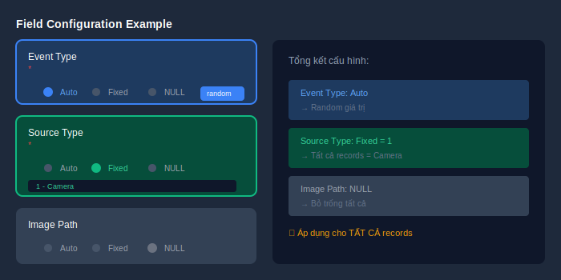

- **Event Type**: Auto (random)
- **Source Type**: Fixed = `1` (Camera)
- **Image Path**: NULL (không bắt buộc)

---

### Bước 5: Generate & Preview Data

#### 5.1 Generate Preview

Click **Generate Preview** để xem trước data trước khi seed.

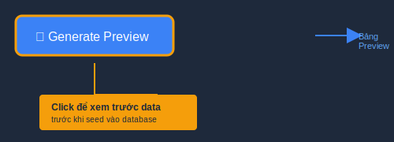

#### 5.2 Xem & Chỉnh sửa Preview

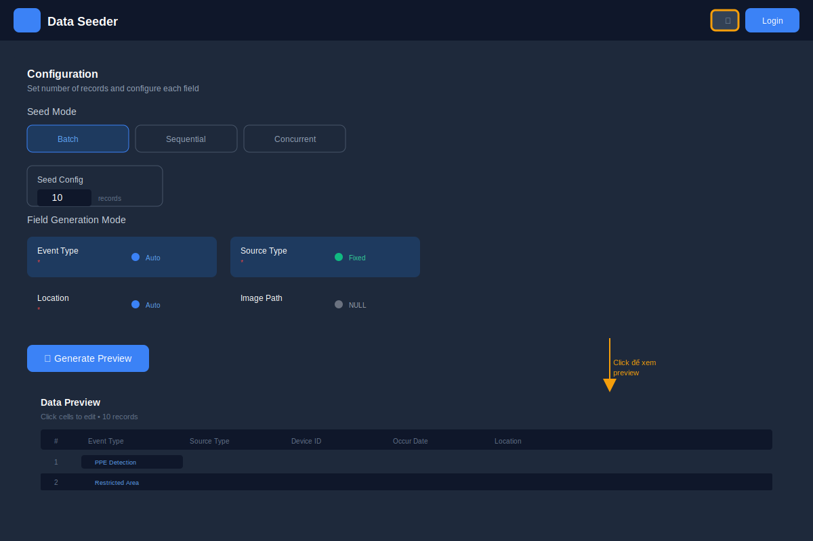

#### Tính năng Preview:
- Hiển thị tất cả records dưới dạng bảng
- Click vào ô để chỉnh sửa giá trị (chỉ fields ở chế độ Auto mới sửa được)
- Fields ở chế độ Fixed/NULL hiển thị disabled

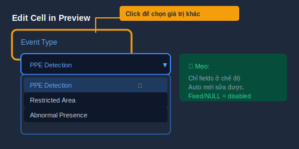

#### 5.3 Xóa Preview

Click **Clear** để xóa preview và quay lại chế độ cấu hình.

---

### Bước 6: Seed Data

#### 6.1 Chuẩn bị Seed

Tùy trạng thái, nút Seed sẽ hiển thị khác nhau:

| Trạng thái | Text hiển thị |
|------------|---------------|
| Chưa cấu hình API | "Configure API in Settings" |
| Chưa đăng nhập | "Login to Seed Data" |
| Đã đăng nhập | "Seed X Records (Batch/Sequential/Concurrent)" |

#### Nút Seed (đã đăng nhập):
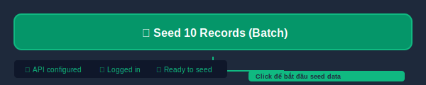

#### 6.2 Quá trình Seed


- Hiển thị progress: `Seeding X/Y...`
- Progress bar cho thấy tiến độ

#### 6.3 Kết quả

**Thành công:**

**Thất bại:**

Thông báo sẽ tự động biến mất sau 3 giây.

---

## Các tính năng chính

### 1. Chọn Mode Fake Data

| Mode | Mô tả |
|------|-------|
| **Auto** | Fake random cho mỗi record khi seed. Đối với các field ID reference đến bảng khác, sẽ random đến các ID có sẵn |
| **Fixed** | Nếu không muốn 1 field nào đó fake, có thể nhập manual, apply cho toàn bộ data sẽ seed |
| **NULL** | Field NULL cho tất cả record khi seed. **Lưu ý**: Required field không thể chọn NULL |

### 2. Generate Preview

Nếu muốn chi tiết hơn, có thể generate preview và sửa manual từng field của mỗi record.

### 3. Chọn Mode Request

| Mode | Mô tả |
|------|-------|
| **Batch** | Gửi số lượng lớn record |
| **Sequential** | Seed 1 record. Backend sẽ dùng cấu trúc dữ liệu dạng queue để buffer data lại, sau đó insert vào database khi đủ số lượng hoặc hết thời gian chờ |
| **Concurrent** | Giả lập số lượng lớn sequential request gọi đồng thời |

---

## Known Issues

- [ ] Đối với các field ID reference đến bảng khác, thì sẽ random đến các ID có sẵn (chưa hoàn thiện)
- [ ] UX đăng nhập đang rất phèn
- [ ] Navigation đến các resource cần seed đang chưa có, cứ phải back ra homepage rồi vào lại rất chuối

## Technical Notes

- Mỗi khi import `pkceAuthService` là lại tạo 1 instance mới, cần chuyển sang singleton toàn app.
- cần có cách để phân biệt record nào trong database do seed mà có
  + ví dụ trong VDSEventData, có thể thêm đuôi "%-SEEDED" vào lanecode
